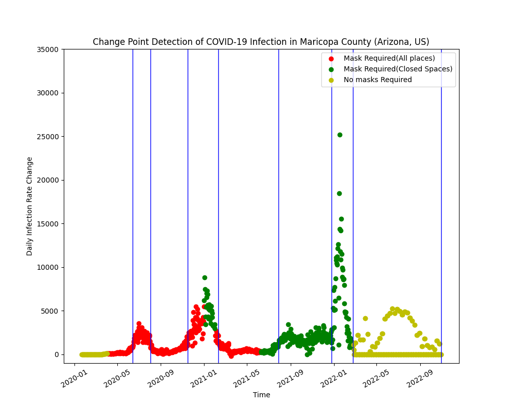

# data512-project-common-analysis

This repository has assignment for DATA-512 - Human Centered Design Project PArt 1 - Common Analysis.

## Goal

We have all been affected by a worldwide pandemic for the past three years. This has had a terrible and disruptive impact on many nations and has had a significant negative personal impact on many people and their families.

The datafication of the pandemic is one feature that has been difficult to ignore during the past three years. In other words, a lot of information on the pandemic's personal cost has been gathered, combined, and presented as data. With the help of this data, we have the opportunity to investigate the pandemic from a variety of prospective angles in order to comprehend how it has affected individuals as well as society. To be completely honest, we are just now beginning to understand and appreciate these effects.

By completing a human-centered data science study of the existing COVID-19 data, we aim to look at some of the social dimensions of the pandemic throughout this course project. Every student in the course will use the same datasets for Part 1: Common Analysis. Students will be given the task of analyzing data for a single US county.

Count Assigned: Maricopa County, Arizona, United States


## Datasource Information

The data for this project is extracted has different aspects and way of collection. One source is CDC for county specific information, other John Hopkins with confirmed cases data shared on Kaggle and other is New York Times Survey data.

#### Dataset Sources
- The RAW_us_confirmed_cases.csv file from the Kaggle repository of John Hopkins University COVID-19 data. This data is updated daily and recent version is used
- The CDC dataset of masking mandates by county. Note that the CDC stopped collecting this policy information in September 2021.
- The New York Times mask compliance survey data.  


## Issues and Special Considerations

The primary reason we use CDC guidelines as the masking policy is that the data obtained from CDC Policy Survellience shows there were no mask mandates established by the state of Arizona in any of the counties, let alone Maricopa County. The initial intuition was to use the voluntary mask data but it would be unfair to generalize the data obtained from a 2-week survey to a very large timeframe. The voluntary masking survey shows us that 73.4% of the people in Arizona always wore masks and 95% of people wore masks more than sometimes. This timeframe (July 2 - July 14) was when CDC had nationwide guidelines for wearing masks. So, technically our assumption is people in the county were following CDC guidelines religiously without a state mandate. Hence, we use CDC guidelines as the basis of the analysis.

## Repository Structure
Here are the main folders in the github data-512-project-common-analysis repository:
```bash

├── README.md
├── LICENSE
├── part1_visualization.png
├── Part_1_CommonAnalysis_RohitLokwani.ipynb
├── Part1_VisualizationExplanation.pdf
├── Part1_Reflection_Statement.pdf
```

## Snapshot of analysis output

#### Rate of New Covid Cases with the Mask Policies in Maricopa County, AZ
 

The visualization shows the change points in the time series data for changes in daily confirmed cases data in Maricopa county in Arizona state in the United States. The X-axis represents the day of the data point. The Y-axis represents the daily infection rate change. The X-axis essentially did not require any pre-processing as the data available seemed complete and accurate. The Y-axis was derived using the confirmed cases data provided by John Hopkins Hospital. We took this value, then calculated the daily infection rate change by calculating the change/slope over the cumulative cases given by the data. The colors of the data points show the national-level masking policy by the CDC (as indicated in the legends) and the blue vertical lines indicate the change points calculated using the Pelt Search method. The best way to read the graph for the viewer is to go from left to right and see how a change in masking policy was causing a change point in the data after almost 1 month in at least 2 instances. The graph is also indicative of the fact that the CDC changed the policies to less strict ones when these infection rate changes were negative and more strict ones when the other way round. 

### Detailed analysis of the visualization
1. We see the first change point around 2020-06, which was the first peak of the pandemic, before this even if the masking policies were implemented, people were probably not very serious about it, hence strictly wearing mask policy might not have worked. But then over time masks seemed to work. (Some evidence of masking impacting cases over the longer progression)
2. At the second set of change points, we see that when the cases were declining, the CDC changed the guidelines to less strict policy and the cases continued to decline (No real evidence of mask policy change impact on cases)
3. At the 5th change point (2021-08), we see the mask policy was made less strict and almost a month later the cases started to rise. (Noticeable impact of masks onto the cases)
4. At the next change point, we see that vaccines were available, and people might have reduced wearing masks which led to a rise in cases again and then the next changes would be more of due to vaccines and herd immunity over masks.

Overall, connecting the dots backwards, we could see some impact of masks on infection rates but not always as we ignore the subjective/qualitative aspects of the broader problem (vaccinations, herd immunity, recovery rates, hospitalizations)
    
### Languages used: Python
